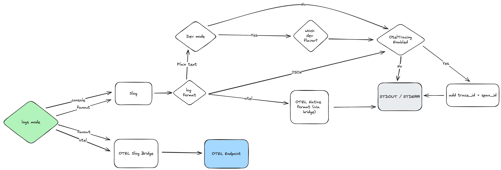

# LoggerGo

  [](https://pkg.go.dev/github.com/wasilak/loggergo) [](https://codeclimate.com/github/wasilak/loggergo/maintainability)

A lightweight, customizable logging library for Go, designed to provide flexible and simple logging capabilities.



## Features

- Simple API for various log levels (Info, Debug, Error).
- Customizable log formats and outputs.
- Lightweight and easy to integrate.
- Supports OTEL (OpenTelemetry) by injecting `spanID` & `traceID` into logs.
- By default registers as `slog.Default()` but this can be change via option

## Installation

To install LoggerGo, run:

```bash
go get github.com/wasilak/loggergo
```

## Usage

Here's a basic example of how to use LoggerGo:

```go
package main

import (
  "context"
  "flag"
  "log/slog"
  "os"

  "github.com/wasilak/loggergo"
)

func main() {
  ctx := context.Background()
  logLevel := flag.String("log-level", os.Getenv("LOG_LEVEL"), "log level (debug, info, warn, error, fatal)")
  logFormat := flag.String("log-format", os.Getenv("LOG_FORMAT"), "log format (json, plain, otel)")
  devMode := flag.Bool("dev-mode", false, "Development mode")
  otelEnabled := flag.Bool("otel-enabled", false, "OpenTelemetry traces enabled")
  flag.Parse()

  loggerConfig := loggergo.Config{
  Level:        loggergo.LogLevelFromString(*logLevel),
  Format:       loggergo.LogFormatFromString(*logFormat),
  OutputStream: os.Stdout,
  DevMode:      *devMode,
  Output:       loggergo.OutputConsole,
  }

  if *otelEnabled {

  loggerConfig.OtelServiceName = os.Getenv("OTEL_SERVICE_NAME")
  loggerConfig.Output = loggergo.OutputFanout
  loggerConfig.OtelLoggerName = "github.com/wasilak/loggergo" // your package name goes here
  loggerConfig.OtelTracingEnabled = false
  }

  // this registers loggergo as slog.Default()
  _, err := loggergo.LoggerInit(ctx, loggerConfig)
  if err != nil {
  slog.ErrorContext(ctx, err.Error())
  os.Exit(1)
  }

  slog.InfoContext(ctx, "Hello, World!")
}
```

## Contributing

Contributions are welcome! Please fork the repository, make changes, and submit a pull request.

---

Feel free to adjust the example to better match the specific functionality of your library.
